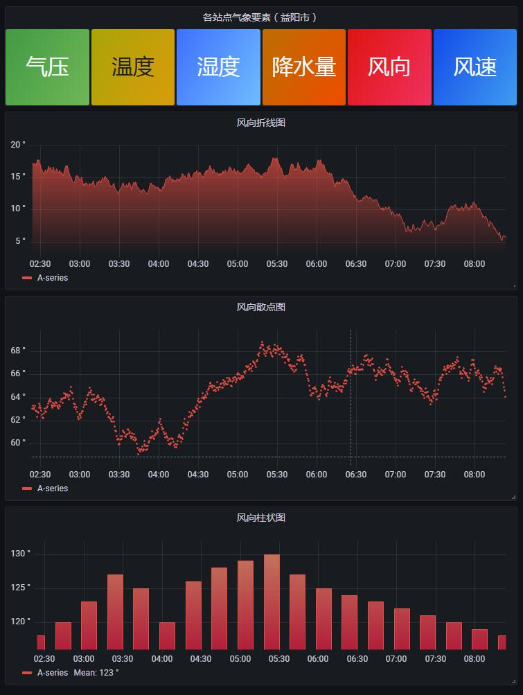

# 气象面板

&ensp;&ensp;&ensp;&ensp;grafana气象面板，用于展示气象六要素。扫描结果存储于mysql或mariadb，grafana使用sql语句直接读取数据库并配合自带图形进行展示。
#### 效果图

#### 运行环境
&ensp;&ensp;&ensp;&ensp;操作系统：CentOS Linux release 7.7.1908 (Core)  
&ensp;&ensp;&ensp;&ensp;数据库：5.5.68-MariaDB（yum安装）  
&ensp;&ensp;&ensp;&ensp;grafana：latest（v8.2.x）
#### 使用方法
1. 提前创建好数据库 grafana_template，导入测试数据，测试数据为 module_qixiangyaosu.sql。  
2. 在 grafana 创建mysql数据源，注意数据源名称为 mysql_grafana_template 和 TestData DB。  

3. 点击“Create”-“Import”，可以直接上传JSON文件，也可以将文件内容复制到“Import via panel json”下方的文本框中加载。模板为 grafana_mysql_template.json 。

